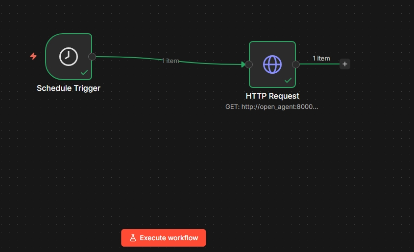
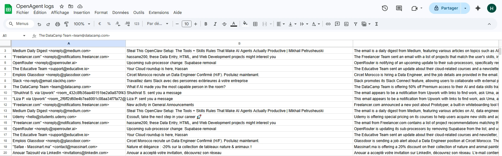

# Email Automation Agent

An intelligent email automation system that reads Gmail inbox emails, classifies them using an LLM, logs general emails to Google Sheets, and creates Google Calendar events for meeting-related emails. The system runs as a Dockerized FastAPI service with an n8n workflow for scheduled automation and a web dashboard for monitoring.

---

## Architecture

```
Gmail Inbox
    |
    v
open_agent (FastAPI)
    |
    |-- Groq (Llama 3.3-70b) --> classify + summarize
    |
    |-- log_to_sheets --> Google Sheets
    |-- create_event  --> Google Calendar
    |
    v
Dashboard (http://localhost:8000/ui)

n8n (http://localhost:5678)
    |
    |-- Schedule Trigger --> GET /fetch --> open_agent
```

---

## Stack

- **Backend**: FastAPI, Python 3.11
- **LLM**: Groq API (Llama 3.3-70b-versatile)
- **Google APIs**: Gmail, Google Sheets, Google Calendar
- **Automation**: n8n
- **Cache**: diskcache (SQLite)
- **Infrastructure**: Docker, Docker Compose

---

## Project Structure

```
email_automation_agent/
├── open_agent/
│   ├── app/
│   │   ├── main.py         # FastAPI entry point and routes
│   │   ├── agent.py        # Groq LLM logic
│   │   ├── prompts.py      # System and email prompts
│   │   ├── schemas.py      # Pydantic models
│   │   ├── tools.py        # Gmail, Sheets, Calendar wrappers
│   │   └── memory.py       # diskcache processed email store
│   └── config.py           # Settings via pydantic-settings
├── google_integration/
│   ├── auth.py             # Google OAuth2
│   ├── gmail.py            # Gmail API
│   ├── sheets.py           # Google Sheets API
│   └── gcalendar.py        # Google Calendar API
├── frontend/
│   ├── index.html          # Dashboard UI
│   └── dashboard.js        # Dashboard logic
├── n8n_workflows/
│   └── trigger_email.json  # n8n workflow export
├── credentials/
│   ├── google_credentials.json
│   └── token.json
├── Dockerfile
├── docker-compose.yml
├── requirements.txt
└── .env
```

---

## Setup

### Prerequisites

- Docker and Docker Compose
- Google Cloud project with Gmail, Sheets, and Calendar APIs enabled
- Groq API key (https://console.groq.com)

### 1. Clone the repository

```bash
git clone <repo-url>
cd email_automation_agent
```

### 2. Configure environment variables

Copy `.env.example` to `.env` and fill in the values:

```
GROQ_API_KEY=your_groq_api_key
GOOGLE_CREDENTIALS_PATH=credentials/google_credentials.json
GOOGLE_TOKEN_PATH=credentials/token.json
SPREADSHEET_ID=your_google_sheet_id
```

### 3. Add Google credentials

Place your `google_credentials.json` file in the `credentials/` folder. On first run, the OAuth flow will generate `token.json` automatically.

### 4. Run with Docker

```bash
docker-compose up --build
```

- Agent API: http://localhost:8000
- Dashboard: http://localhost:8000/ui
- API docs: http://localhost:8000/docs
- n8n: http://localhost:5678

---

## API Endpoints

| Method | Endpoint | Description |
|---|---|---|
| GET | `/` | Health check |
| GET | `/fetch?max_results=10` | Fetch and process emails |
| GET | `/stats` | Total processed count |
| GET | `/history` | All processed email records |
| GET | `/events` | Google Calendar events for current month |

---

## How It Works

1. n8n triggers `GET /fetch` on a schedule (every 15 minutes by default)
2. The agent fetches unread emails from Gmail
3. Each email is sent to Groq (Llama 3.3-70b) with the system prompt
4. The model returns a JSON action:
   - `log_to_sheets`: email is summarized and logged to Google Sheets
   - `create_event`: a Google Calendar event is created from the email details
5. Processed email IDs are cached to avoid reprocessing
6. Results are visible on the dashboard

---

## Screenshots

### n8n Workflow



### Google Sheets Output



---

## Notes

- The Groq free tier has a token-per-minute (TPM) limit. Keep `max_results` low (5-10) to avoid rate limit errors.
- The Google OAuth token is stored in `credentials/token.json`. If it expires, delete the file and restart to re-authenticate.
- Processed emails are cached in `cache/processed_emails/`. Delete this folder to reprocess all emails.
